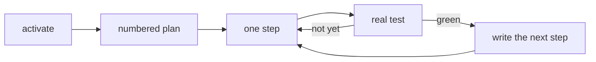

<p align="center">
  
</p>

<p align="center">
  <a href="LICENSE"></a>
  <a href="https://x.ai/build"></a>
  <a href="https://hermes-agent.nousresearch.com/"></a>
  <a href="#tests"></a>
</p>

<p align="center">A skill for <a href="https://x.ai/build">Grok Build</a> and <a href="https://hermes-agent.nousresearch.com/">Hermes Agent</a>.</p>

---

## Problem

Long coding sessions with Grok keeps dying.

## Solution

A tiny skill. It writes the plan as a numbered list, does one step, runs a real test, writes down the next step. Next chat reads that file and keeps going.

## How



| File | Job |
|------|-----|
| `.glrp/GOAL.md` | The whole plan, numbered. |
| `.glrp/UNIT.md` | The one step happening now. |
| `.glrp/progress.txt` | Steps already done. |
| `.glrp/config.toml` | `verify` — your real test command. |

Scripts: `activate.py` · `next.py` · `check.py` · `close_unit.py`

## Install

```bash
git clone https://github.com/msinclair25/glrp.git
bash glrp/install.sh
```

Puts the skill in `~/.grok/skills/glrp/` and `~/.hermes/skills/glrp/` when those folders exist. Start a **new session** so it loads.

## Use

In a git project:

1. Say `activate glrp` or `/glrp`.
2. Set `verify = "pytest -q"` (or whatever actually tests your project).
3. Paste the brief. It numbers the plan and starts step one.
4. It does that step, runs the test, writes the next step, and **keeps going** this sitting.
5. If you start a new chat, it reads the file and continues.

```
skill/scripts/   activate.py  next.py  check.py  close_unit.py
.glrp/           GOAL.md  UNIT.md  progress.txt  config.toml
```

## Tests

```bash
python3 -m unittest discover -s tests -v
```

## License

[MIT](LICENSE) · Morgan Sinclair ([@msinclair25](https://github.com/msinclair25))
