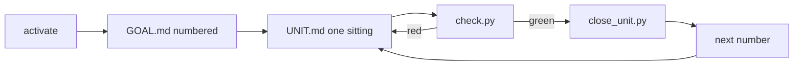

<p align="center">
  
</p>

<p align="center">
  <a href="LICENSE"></a>
  <a href="https://x.ai/build"></a>
  <a href="https://hermes-agent.nousresearch.com/"></a>
  <a href="#tests"></a>
</p>

<p align="center"><b>A tiny skill so Grok doesn’t forget the plan, rewrite the last sitting, or wander off the job.</b></p>

<p align="center">For <a href="https://x.ai/build">Grok Build</a> and <a href="https://hermes-agent.nousresearch.com/">Hermes Agent</a>. Not a playbook. Not a second brain.</p>

---

## The problem

Long agentic coding dies in three boring ways:

1. **Amnesia** — new session, no idea what’s next.
2. **Drift** — it “helps” by building the website you said not to build.
3. **Fake green** — `verify = true` never fails, so it ships vibes.

GLRP is three files and four scripts. That’s the product.

## The loop



| File | Job |
|------|-----|
| `.glrp/GOAL.md` | The whole product, numbered. Later corrections win. Do-not-build is *not* a unit. |
| `.glrp/UNIT.md` | What to do **now**. Never “do not implement yet.” |
| `.glrp/progress.txt` | What already closed. Every number in a sitting, not just the first. |
| `.glrp/config.toml` | `verify` — a command that can **fail**. |

## Install

```bash
git clone https://github.com/msinclair25/glrp.git
bash glrp/install.sh
```

Copies into `~/.grok/skills/glrp/` and/or `~/.hermes/skills/glrp/` if those homes exist. **Start a new session** so the skill reloads.

## Use

In a **git project** (never `$HOME`):

1. Say `activate glrp` or `/glrp`.
2. Set `.glrp/config.toml` → `verify = "pytest -q"` (or your real check).
3. Dump the brief. The skill numbers `GOAL.md` and aims `UNIT.md` at the first sitting.
4. After edits: `check.py`. Red → stay. Green → `close_unit.py`.
5. New session: `next.py` first. Then only the current number.

```
skill/scripts/   activate.py  next.py  check.py  close_unit.py
.glrp/           GOAL.md  UNIT.md  progress.txt  config.toml
```

## What it is not

- Not [GLRP-Skill](https://github.com/msinclair25/GLRP-Skill). Do **not** run both on the same project.
- Not a bigger prompt. Extra playbook is more drift.
- Not a promise Grok can finish every sitting. When `UNIT` + a real check still fails, that’s the model — not a missing paragraph.

## Tests

```bash
python3 -m unittest discover -s tests -v
```

## License

[MIT](LICENSE) · Morgan Sinclair ([@msinclair25](https://github.com/msinclair25))
