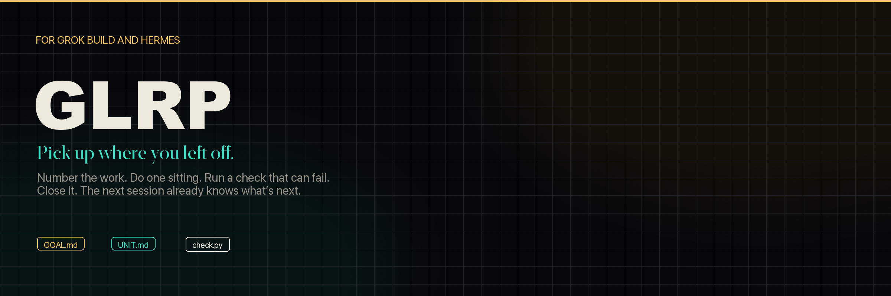
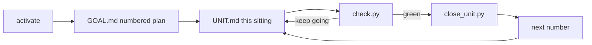

<p align="center">
  
</p>

<p align="center">
  <a href="LICENSE"></a>
  <a href="https://x.ai/build"></a>
  <a href="https://hermes-agent.nousresearch.com/"></a>
  <a href="#tests"></a>
</p>

<p align="center"><b>GLRP keeps a coding agent on one sitting of work — and hands the next sitting to the next session.</b></p>

<p align="center">A skill for <a href="https://x.ai/build">Grok Build</a> and <a href="https://hermes-agent.nousresearch.com/">Hermes Agent</a>.</p>

---

## What it does

You dump a messy product brief. GLRP turns that into a numbered plan, picks **one** sitting, and ties it to a command that can fail. When the sitting is green, it closes that number and writes the next one down.

A new chat opens cold. It reads the two files, does the current number, and stops. The plan lives on disk, so the work can run across days.

**In one line:** remember what’s next, do only that, prove it.

## How it works



| File | What the agent uses it for |
|------|----------------------------|
| `.glrp/GOAL.md` | The whole product, numbered. Later corrections replace earlier ones. |
| `.glrp/UNIT.md` | The sitting in progress — files, behavior, how we’ll know it’s done. |
| `.glrp/progress.txt` | Closed numbers, so the next session doesn’t rewind. |
| `.glrp/config.toml` | `verify` — your real project check (`pytest`, `unittest`, a script). |

Four scripts drive the loop: `activate.py`, `next.py`, `check.py`, `close_unit.py`.

## Install

```bash
git clone https://github.com/msinclair25/glrp.git
bash glrp/install.sh
```

Installs to `~/.grok/skills/glrp/` and `~/.hermes/skills/glrp/` when those homes exist. Start a **new session** so the skill loads.

## Use

In a git project:

1. Say `activate glrp` or `/glrp`.
2. Point `verify` at a real check: `verify = "pytest -q"`.
3. Paste the brief. The skill numbers `GOAL.md` and aims `UNIT.md` at sitting one.
4. It implements that sitting, runs `check.py`, and closes when green.
5. Next session: `next.py` first, then only the current number.

```
skill/scripts/   activate.py  next.py  check.py  close_unit.py
.glrp/           GOAL.md  UNIT.md  progress.txt  config.toml
```

## Tests

```bash
python3 -m unittest discover -s tests -v
```

## License

[MIT](LICENSE) · Morgan Sinclair ([@msinclair25](https://github.com/msinclair25))
